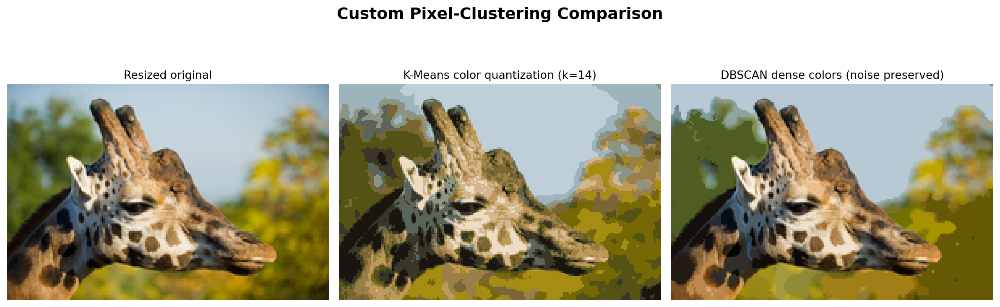

# Image Clustering from Scratch: K-Means and DBSCAN


An educational computer-vision project that implements the clustering logic of
K-Means and DBSCAN, then applies both algorithms to image pixels. The emphasis is
algorithm correctness, reproducibility, and explaining why feature design changes
the result.

> This is **color-based image clustering**, not semantic segmentation. The model
> does not know that the image contains a giraffe; it only groups similar feature
> vectors.

## Result



The included experiment resizes the image to 200 × 134 pixels and clusters all
26,800 pixels.

| Method | Feature space | Verified result |
|---|---|---:|
| K-Means | RGB values | 14 clusters; inertia 12,418,111.68 |
| DBSCAN | normalized RGB + normalized x/y | 96 clusters; 39.62% noise |

K-Means creates a compact global color palette. DBSCAN instead identifies
density-connected spatial-color regions and leaves low-density pixels as noise.
Its noise pixels are preserved in the reconstruction because averaging all noise
into one artificial color would be misleading.

The DBSCAN image retains more fine detail partly because it has many regions and
preserves 39.62% of pixels classified as noise. That makes it visually faithful,
but it is not a claim that DBSCAN compresses the image better than K-Means.

## What is implemented

### Custom K-Means

- local random-number generator, including correct handling of `random_state=0`;
- five initializations with selection by minimum inertia;
- vectorized squared-distance computation;
- convergence by stable assignments or center movement;
- safe re-seeding of empty clusters;
- fitted attributes and `predict`, following a scikit-learn-style API.

### Custom DBSCAN

- separate states for unvisited points and confirmed noise;
- complete recursive expansion of density-reachable core points;
- reassignment of previously visited noise points as border points when valid;
- radius-neighbor search instead of a dense all-pairs distance matrix;
- core-sample indices and final cluster count.

Scikit-learn is used for input validation, efficient neighbor lookup, and test
comparison. The cluster assignment and expansion logic remains implemented in
`algorithms.py`.

## Why DBSCAN uses spatial coordinates

Using RGB alone made most natural-image colors density-connected, producing one
giant cluster. The experiment therefore combines normalized color with normalized
pixel coordinates:

```text
[red, green, blue, x_position, y_position]
```

This makes proximity mean both visually similar and spatially nearby. The choice
is explicit in `run_clustering.py`, rather than hidden in a notebook.

## Repository structure

```text
.
├── algorithms.py                 # tested custom K-Means and DBSCAN
├── run_clustering.py             # reproducible experiment entry point
├── tests/test_algorithms.py      # algorithm and regression tests
├── image_clustering.ipynb        # thin exploratory interface
├── giraffe.png                   # included sample image
├── outputs/
│   ├── comparison.png
│   ├── kmeans_output.png
│   ├── dbscan_output.png
│   └── metrics.json
└── requirements.txt
```

## Run locally

```bash
git clone https://github.com/adelF-a/image-clustering-project.git
cd image-clustering-project
python3 -m venv .venv
source .venv/bin/activate
pip install -r requirements.txt
python run_clustering.py
python -m unittest discover -s tests -v
```

The script regenerates the comparison, individual outputs, and machine-readable
metrics. The notebook calls the same tested pipeline; it does not duplicate the
algorithm implementation.

## Verification

The seven automated tests cover:

- deterministic K-Means behavior for seed `0`;
- empty-cluster handling without `NaN` centers;
- consistency between fitted labels and `predict`;
- recovery of a known, well-separated three-blob partition;
- DBSCAN expansion beyond the initial core neighborhood;
- exact partition agreement with scikit-learn DBSCAN on a two-moons dataset;
- invalid-parameter rejection.

## Limitations and next experiments

- There is no labeled segmentation mask, so the images provide qualitative
  comparison rather than an accuracy score.
- RGB is not perceptually uniform; CIELAB would be a stronger color space.
- K-Means requires `k`; DBSCAN requires sensitive `eps` and `min_samples` choices.
- A semantic segmentation task would require labeled data and a different model.

Useful extensions would compare RGB with CIELAB, plot K-Means inertia across
candidate values of `k`, and quantify segmentation quality on labeled images.
